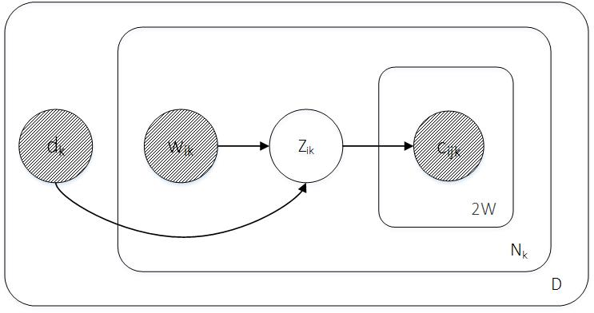
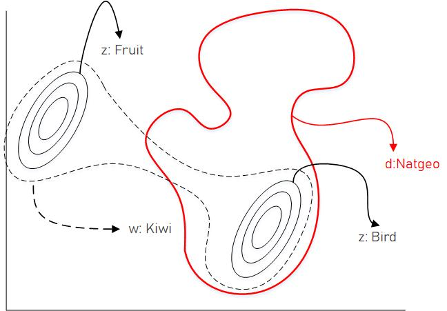

# Latent Meaning Cells
This is the main repository for the Latent Meaning Cells (LMC) Model.

The LMC is a Deep Generative Model for Jointly Modeling Words and Document Metadata.

## Overview of Generative Process

The generative process of the LMC model is shown in plate notation below:



```
For k in 1...D
    Draw metadata d_k ~ p(d_k)
    For i in 1...N_k:
        Draw word w_ik ~ p(w_ik)
        Draw latent meaning z_ik|w_ik,d_k ~ p(z_ik|w_ik, d_k)
    For j in 1...2W:
        Draw context word c_ijk|z_ik ~ p(c_ijk|z_ik)
```

Please refer to the paper for more information on the distributions and model parameters.

### D
represents the set of metadata in the corpus.  This could be the number of unique section headers or even simply the number of documents in the corpus, depending on the modeling choice.

### d<sub>k</sub>
represents the k<sup>th</sup> metadata

### N<sub>k</sub>

represents the number of unique tokens in the k<sup>th</sup> metadata. For our purposes, metadata are pseudo-documents which contain a sequence of words.  For instance, if the metadata is a section header *Discharge Medications*, that metadata is comprised of the concatenation of the body of every section entitled *Discharge Medications* across the corpus.  Yet, when computing context windows, we do not combine text from different physical documents.

### w<sub>ik</sub>

represents the i<sup>th</sup> center word belonging to the k<sup>th</sup> metadata.

### z<sub>ik</sub>|w<sub>ik</sub>,d<sub>k</sub>

represents the latent meaning given the center word **w<sub>ik</sub>** and metadata **d<sub>k</sub>**

### W

denotes the window size. That is, the number of words drawn from the left and right side of the center word. 


### c<sub>ijk</sub>|z<sub>ik</sub>

denotes the j<sup>th</sup> context word given the latent meaning of i<sup>th</sup> center word in k<sup>th</sup> metadata.

This formulation allows for the latent meaning of a word to depend on the metadata (section header, paragraph id, etc.) in which it is found, and vice versa.  For instance,  the latent meaning of a *sports* article is not the same for all *sports* articles. Sports can refer to the NBA, the Olympics, or chess.  Therefore, the concept of a sports article is refined by knowing the words used inside the article.  Conversely, if you see the word *net*, its latent meaning will shift more to basketball than to fishing if you know that it is used within a sports article.  The LMC models both phenomena.  This notion is encapsulated in the below figure.



## Contents

The repository containts the following modules:
1. `acronyms` - Evaluation scripts for clinical acronym expansion
- Also contains custom scripts for each model in `modules` to adapt each neural language model to the acronym expansion task.
2. `modules` - LMC and baseline language model training scripts.  Set up to train on MIMIC-III clinical notes.
- Latent Meaning Cells
- Bayesian Skip-Gram (BSG)
- ELMo
3. `preprocess` - Scripts to preprocess (tokenize, extract section headers) from MIMIC-III notes.
4. `utils` - Utility function store.
5. `weights` - Stores trained weights for language model pre-training as well as optional acronym expansion fine-tuning

## Quick Setup

1. Clone this repository and place it in `~`.
2. Run `pip install -r requirements.txt`
- Note: packages are pinned to exact versions but may work with older versions.  Compatibility is untested for versions not explicitly listed in `requirements.txt`.

## Train Language Model on MIMIC-III

### Downloading Data

1. If you haven't already, please [request access](https://mimic.physionet.org/gettingstarted/access/) to MIMIC-III notes.
2. Follow instructions to download `NOTEEVENTS.csv` and place under `preprocess/data/mimic/`.

### Preprocessing

In `./preprocess`, please run the following scripts in order:
1. `generate_mini_dataset.py` - sample from full dataset to create mini development set (principally for debugging).
2. `compute_sections.py` - Use custom regex to precompute the names of all section headers in MIMIC-III.
3. `tokenize.py` - Tokenize the data and save
4. `subsample_tokens.py` - Subsample frequent tokens to speed-up training and increase effective window size.

The output of these scripts is a series of data files:

``./preprocess/data/mimic/NOTEEVENTS_token_counts.csv``

``./preprocess/data/mimic/NOTEEVENTS_tokenized.csv``

``./preprocess/data/mimic/section_freq.csv``

``./preprocess/data/mimic/ids.npy``

``./preprocess/data/mimic/vocab.pk``


**NB:**
- Please see individual scripts for optional argument flags along with descriptions
- We recommend running each of the above scripts with the optional `-debug` boolean flag which does all preprocessing on the mini version of the dataset as created from `generate_mini_dataset.py`. 
- The last two files are essential for training the language model.

### Training LMC Model

In this section, we describe how to train the jointly contextualized token and document metadata embeddings, as described in the LMC paper.

In `./modules/lmc/`, please run the following training script:

1. `lmc_main.py` - this script trains on MIMIC-III data (preprocesed into `ids.npy` and `vocab.pk`) and serializes learned model weights to a corresponding directory in `./weights/lmc/{experiment_name}/`.
- Please see `lmc_main.py` for all command-line arguments with descriptions
- Please note that, at this point, the `-bert` flag is an experimental feature.

### Training Baselines

**Bayesian Skip-Gram Model (BSG)**

As a primary baseline and source of great inspiration for the LMC, we provide our own PyTorch implementation of the BSG model:
- [Original Theano source code](https://github.com/ixlan/BSG)
- Bražinskas, A., Havrylov, S., & Titov, I. (2017). Embedding words as distributions with a Bayesian skip-gram model. arXiv preprint arXiv:1711.11027.

The training procedure is identical to the original paper.  Yet, the encoder architecture is different: we found better performance by encoding context sequences with a bi-LSTM and summarizing with a simple pooled attention mechanism.  Please see paper and code for more details.

In similar fashion to the LMC, to train the BSG embeddings, please run the following script in `./modules/bsg/`:
1. `bsg_main.py`

**NB:**

In the LMC paper, we introduce a modification of the BSG, referred to as the MBSGE (Metadata Bayesian Skip-Gram Ensemble).  In this specific instance, center word ids are randomly replaced with metadata ids.  This variant is controlled by the boolean flag `-multi_bsg` with parameters `--multi_weights` to control the categorical distribution parameters governing the relative frequency with which words, sections, and note categories are chosen as the pseudo-center word.

**ELMo Baseline**

We also provide a setup to enable training AllenNLP's ELMo model on MIMIC-III. from the seminal ([paper](https://arxiv.org/abs/1802.05365)).

We use the [Transformer based implementation of ELMo](https://github.com/allenai/allennlp/blob/master/docs/tutorials/how_to/training_transformer_elmo.md) given its promising performance.  There is a version mismatch between allennlp's import of Huggingface and the version of Huggingface our code.  As such, we are currently working on a solution and will provide complete documentation for how to run it when available.  For now, all ELMo related code has been commented out.

## Evaluating on Clinical Acronym Expansion

To evaluate pre-trained LMC, BSG, and ELMo models on the task of clinical acronym expansion, please refer to the README in the `acronyms` module.

The code is compatible with two acronym expansion datasets:

1. [CASI dataset](https://www.ncbi.nlm.nih.gov/pmc/articles/PMC3932450/) - this labeled dataset from the University of Minnesota is a common benchmark for clinical acronym expansion and has been pre-processed to work with all models (included in the `shared_data/casi` for convenience).
2. MIMIC-III RS dataset - this is a new dataset that uses the same sense inventory as CASI.  It creates a synthetic dataset using reverse substitution (RS). MIMIC requires a license so please follow instructions in `preprocess/context_extraction` to generate the dataset.

Each dataset is runnable with the same script by toggling the flag `--dataset {mimic, casi}`.


